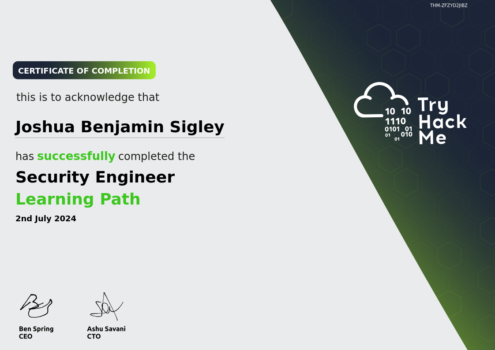
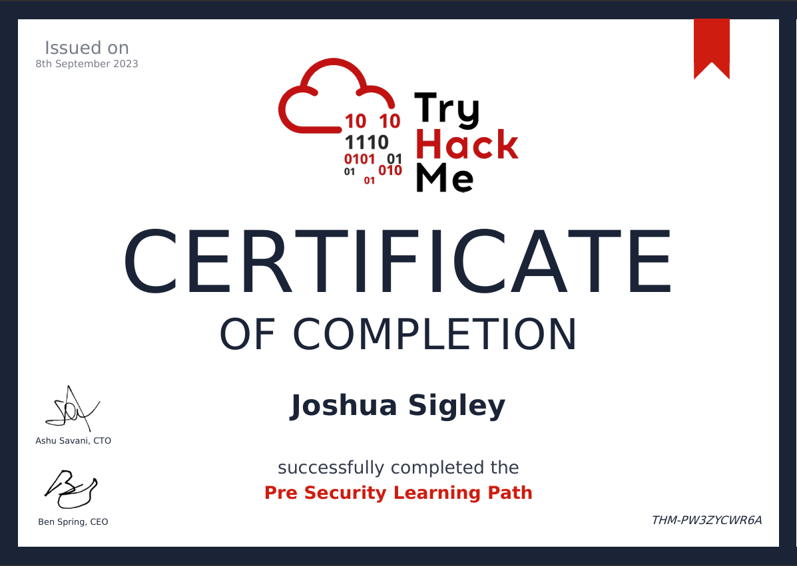
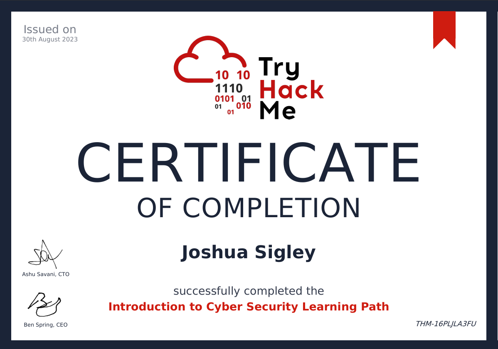
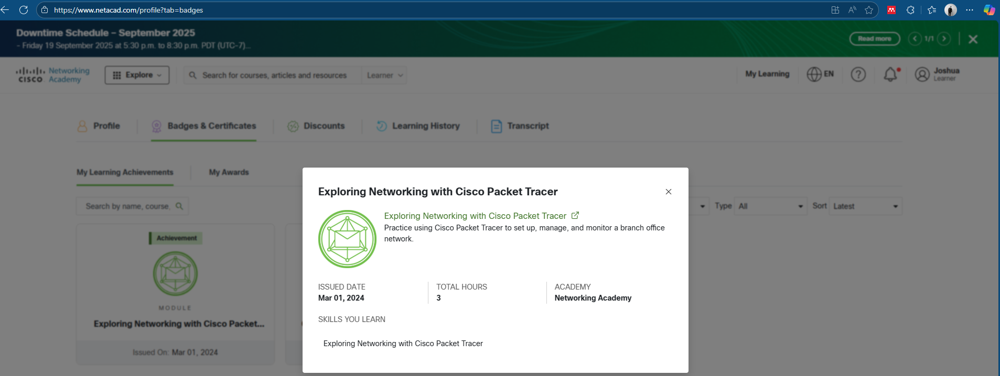
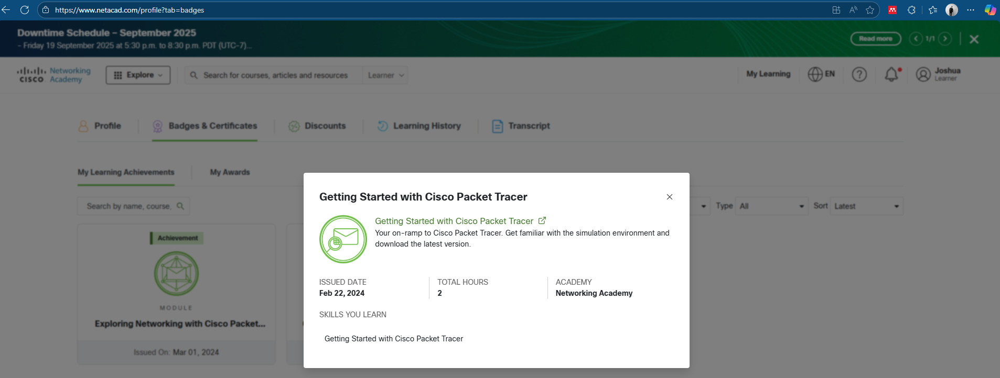

# My Hands-On Cybersecurity Portfolio

This repository documents my comprehensive learning journey through key learning paths on the **TryHackMe** platform. It serves as a practical portfolio of my foundational skills, demonstrating a clear progression from core concepts to specialised areas like security engineering.

---

## 📜 Certificates of Completion

### 1. Security Engineer Path

This path provided me with the knowledge and hands-on skills required to design, implement, and maintain secure systems.

**Date of Completion:** 2 July 2024

**Key Skills & Tools Demonstrated:**

* **Network and System Security:**
    * **Secure Network Architecture:** Learnt about securing network devices, protocols, and best practices for creating a hardened network perimeter.
    * **Linux System Hardening:** Used tools and commands like `ls`, `cd`, `grep`, and `sudo` to configure and secure Linux servers and systems against common threats.
    * **Microsoft Windows Hardening:** Learnt to secure Windows environments, including configuring **Active Directory** and understanding Group Policy Objects (GPOs) to enhance security.
* **Software Security:**
    * **Vulnerability Assessment:** Explored common vulnerabilities using the **OWASP Top 10** framework.
    * **Security Testing:** Practised both **Static Application Security Testing (SAST)** and **Dynamic Application Security Testing (DAST)** to find and report vulnerabilities in code and running applications.
* **Managing Incidents:**
    * **Incident Response (IR):** Understood the role of a first responder and used logging for accountability.
    * **Cyber Crisis Management:** Learned the process for responding to and recovering from a major cyber attack.

---

### 2. Pre Security Path

This path served as my first step into the world of cybersecurity, providing the essential foundational knowledge needed for any role in the field.

**Date of Completion:** 8 September 2023

**Key Skills & Concepts Gained:**

* **Networking Fundamentals:** I gained a solid understanding of fundamental networking concepts, including the **OSI model**, the **TCP/IP stack**, and how protocols like **DNS** and **HTTP** work to power the web.
* **Linux Fundamentals:** Gained hands-on experience with the Linux command line through labs like `Linux Fundamentals Part 1, 2, and 3`, learning how to navigate the file system, manage files, and use essential commands.
* **Windows Fundamentals:** I explored the core components of the Windows operating system, including the file system (`NTFS`), the **Control Panel**, and the **Windows Registry**.
* **Web Fundamentals:** Learnt about how websites function, focusing on the roles of web browsers, web servers, and the importance of firewalls and load balancers.

---

### 3. Introduction to Cyber Path

This pathway offered a holistic view of the cybersecurity industry, covering both offensive and defensive security disciplines.

**Date of Completion:** 30 August 2023

**Key Skills & Tools Gained:**

* **Offensive Security:**
    * **Basic Exploitation:** I was introduced to core offensive tools like **Nmap** for network scanning, **Wireshark** for packet analysis, and **Hydra** for password cracking.
    * **Vulnerability Scanning:** Used tools like **Gobuster** to find hidden directories and files on a web server.
* **Defensive Security:**
    * **Incident Response:** Learnt about defensive security tools and methods, including understanding **Digital Forensics** and **Incident Response**.
    * **Security Operations Centre (SOC) Fundamentals:** Gained a high-level understanding of SOC roles, threat intelligence, and the **Cyber Kill Chain** framework.
* **Core Fundamentals:**
    * **Linux and Windows:** Learnt the foundational commands for navigating and interacting with both Linux and Windows operating systems.
    * **Cryptography:** Gained an understanding of core cryptographic concepts and basic hashing.

---
#### **Forage**

* **ANZ Cybersecurity**: This program gave me hands-on experience with real-world cybersecurity tasks from ANZ, including threat analysis and incident handling.

* **Deloitte Data Analytics**: A virtual experience that focused on using data analytics for business insights and problem-solving, a valuable skill in cybersecurity.

* **CommBank Cybersecurity**: This program simulated tasks a cybersecurity professional at Commonwealth Bank would perform, focusing on identifying vulnerabilities and protecting data.

#### **Cisco Networking Academy**

* **Exploring Networking with Cisco Packet Tracer (Feb 2024)**: I gained practical experience in building and configuring networks using Cisco Packet Tracer.

* **Getting Started with Cisco Packet Tracer (Feb 2024)**: This course provided a solid introduction to the Packet Tracer tool, which is essential for network simulations.

#### **LinkedIn Learning**

* **Professional Networking**: This certificate highlights my understanding of how to build and maintain professional relationships, which is key in the tech industry.

#### **Formal Qualifications**

* **Certificate III in Security Operations**: A formal qualification that covers foundational security principles, risk management, and surveillance, providing a broad understanding of the security industry.
## 🚀 My Learning Journey

Completing these three paths has provided me with a strong and versatile foundation in cybersecurity. I started with **Introduction to Cyber** and **Pre Security** to build my core knowledge, and then advanced to the more specialised **Security Engineer** path to gain hands-on skills in a key domain.

My next step is to prepare for the **Google Cybersecurity Professional** certification, which will further validate my skills and help me secure my first role in the industry.

## 🔗 Links

* **TryHackMe Profile:** https://tryhackme.com/p/suavesigley
* **LinkedIn:** www.linkedin.com/in/suavesigley
